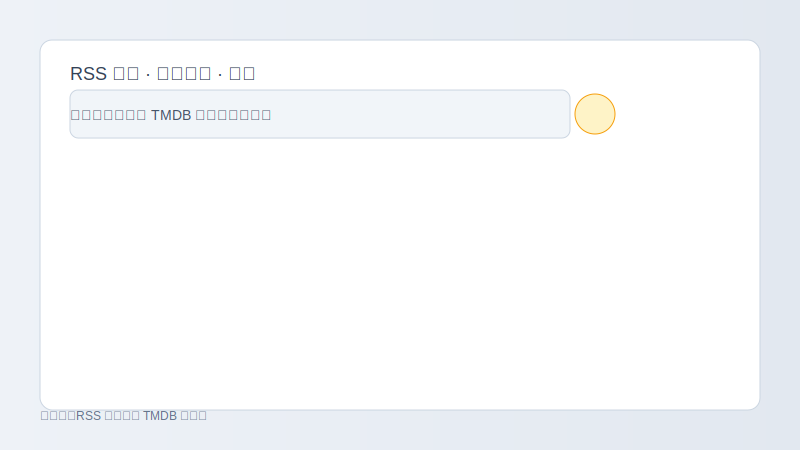
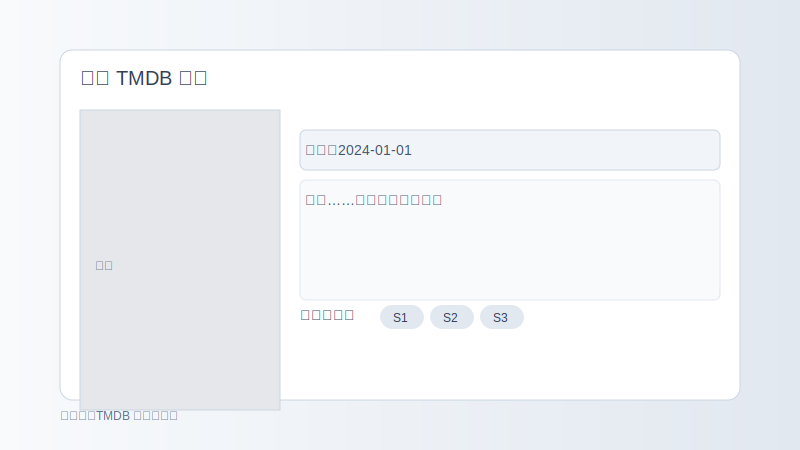

# my_qb_tools

一个用于配合 qBittorrent 的轻量工具集，包含 Web 界面增强与本地整理工具：在不改变日常下载习惯的前提下，更方便地为剧集添加 TMDB 信息、选择季度，并按自定义规则整理到媒体库。

> 说明：项目以个人需求为主，功能会以“够用、好用”为目标逐步演进。

## 亮点功能

- TMDB 一键标注
  - RSS 规则页面：在“种子参数 → 标签”输入框右侧新增 TMDB 图标按钮，搜索剧集并自动写入标签
  - 种子列表/详情：可打开“设置 TMDB 信息”对话框，查看海报/简介，选择季度并保存
- 友好的选择对话框
  - 搜索结果点击即显示详情，支持海报、简介、首播时间与季度单选
  - 搜索输入支持防抖，减少无效请求
  - 可清除已保存的 TMDB/Season 标签
- 统一标签规范
  - `tmdb=<id>-<title>` 与 `season=<num>`，易于检索与脚本处理
- 多语言与样式优化
  - 调整对话框布局与宽度，更清晰的标签与提示文案
- 可选的本地整理脚本
  - 支持按 TMDB/季将已下载内容硬链接到媒体库目录，并生成 `tvshow.nfo`

## 快速开始

- 启动前端
  - 安装依赖后运行开发服务：`npm install && npm run dev`
  - 构建发布包：`npm run build`

- TMDB 使用建议
  - 建议通过“后端代理”访问 TMDB：前端请求 `/backend/tmdb`，由服务端转发并在请求头附加密钥
  - 不要将 TMDB Token 放入前端构建产物（避免泄漏）

### 后端代理（简述）

- 前端只访问 `/backend/tmdb`。
- 由你的服务器/反向代理转发到 TMDB 官方接口，并在服务器端添加 `Authorization: Bearer <TMDB Token>`。
- 这样前端不会包含 Token，也不会在浏览器网络请求里暴露 Token。

## 使用方式

- 在 RSS 规则对话框里
  - 点击“标签”输入框右侧的 TMDB 图标，搜索并选择剧集与季度，完成后自动回填 `tmdb=` 与 `season=` 标签

- 在种子列表/详情里
  - 打开“设置 TMDB 信息”，同样可以搜索、查看详情、选择季度并保存，或清除已保存的信息

- 标签示例
  - `tmdb=277513-某剧名`，`season=1`

## 界面预览

下列为占位示意，替换为你的实际截图：

## 版本

- 当前版本：v0.1.2
  - RSS 规则新增 TMDB 选择器
  - TMDB 搜索支持防抖
  - 一些文案与界面优化

## 免责声明

本项目仅用于个人学习与整理用途，不保证向后兼容性与完整跨平台支持。请在确认行为符合你的预期后再批量使用。

## 最近更新（v0.1.2）

- RSS 规则：在“种子参数 → 标签”输入框右侧新增 TMDB 图标按钮，点击可搜索剧集并自动写入 `tmdb=` 与 `season=` 标签。
- TMDB 搜索：输入支持防抖，减少无效请求，体验更流畅。
- 安全提示：请勿将 TMDB Token 放入前端构建产物。推荐使用后端代理访问 TMDB（前端走 `/backend/tmdb`，由服务端在请求头附加密钥）。如曾泄漏 Token，请在 TMDB 控制台重置后再部署。
